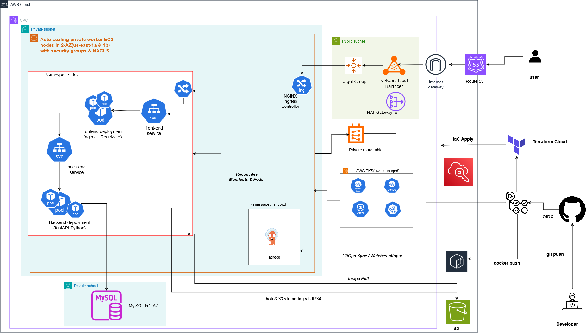

# SteNox Webhook Inspector

A production-grade, highly available cloud-native webhook inspection platform and multi-tier web application deployed on **Amazon Web Services (AWS)** using **Infrastructure as Code (Terraform Cloud)**, **GitHub Actions OIDC**, containerization (**Docker**, **Amazon ECR**), and automated GitOps continuous delivery (**Argo CD** on **Amazon EKS**).

---

## Architecture Diagram



---

## Architectural Decisions & Highlights

* **Zero-Touch Bootstrap**: Cluster initialization—including application namespaces, IAM Roles for Service Accounts (IRSA), Ingress-NGINX controllers, External-Secrets operators, and Argo CD GitOps reconcilers—is managed dynamically via Terraform. No manual `kubectl apply` commands are used to prepare the environment.
* **Ambient Pod Security via IRSA**: No AWS access keys or static credentials reside inside containers or environment variables. The `stenox-backend-sa` Kubernetes ServiceAccount leverages AWS OIDC federation to acquire scoped temporary credentials for streaming binary assets directly to private Amazon S3 buckets.
* **Keyless Workflows via GitHub OIDC**: CI/CD pipelines communicate with AWS strictly via dynamic OpenID Connect (OIDC) federated role assumption, eliminating long-lived static AWS access keys entirely from repository storage.
* **Separation of Secrets Lifecycle**: Sensitive database passwords and application keys are isolated from Git and Terraform state. Developers seed AWS Secrets Manager once, and the in-cluster External Secrets Operator syncs those key-value pairs into native Kubernetes `Secret` resources.
* **High Availability Network Topologies**: The application spans multiple AWS Availability Zones. Public subnets host internet-facing Network Load Balancers (NLBs) and NAT Gateways, while compute instances and RDS MySQL instances run entirely within isolated private subnets.
* **Automated GitOps Reconciliation**: Continuous delivery operates on an App-of-Apps design pattern. Container build pipelines update immutable Git SHA tags within `k8s/dev/kustomization.yaml`, which triggers Argo CD to run automated sync, canary validation, and self-healing.

---

## Repository Tree
**subjected to changes**
```text
.
├── .github/
│   └── workflows/
│       ├── app-deploy.yml              # CI/CD: Builds Docker images, updates Kustomize Git SHA
│       └── terraform.yml               # IaC: Executes Terraform Plan & Apply via Terraform Cloud
├── gitops/
│   ├── root-application.yml           # Argo CD App-of-Apps root controller
│   └── stenox-dev-app.yml             # Argo CD Dev environment application manifest
├── k8s/
│   └── dev/
│       ├── backend/
│       │   ├── aws-secretsmanager.yml  # ExternalSecret resource pulling AWS secret
│       │   ├── deployment.yml          # FastAPI deployment linked to IRSA ServiceAccount
│       │   ├── secret-store.yml        # ClusterSecretStore definition
│       │   └── service.yml             # Backend ClusterIP service (Port 8000)
│       ├── frontend/
│       │   ├── deployment.yml          # Nginx/React deployment
│       │   └── service.yml             # Frontend ClusterIP service (Port 80)
│       ├── ingress.yml                 # L7 ingress rules mapped to Ingress-NGINX
│       └── kustomization.yaml          # Image tag orchestrator updated by CI
├── src/
│   ├── backend/                        # FastAPI application source, Dockerfile, migrations
│   └── frontend/                       # React SPA source, Dockerfile, Nginx config
└── terraform/
    ├── modules/
    │   ├── database/                   # Amazon RDS MySQL module
    │   ├── ecr/                        # Amazon ECR container registries module
    │   ├── eks/                        # EKS Cluster, node groups, and IRSA IAM configurations
    │   ├── network/                    # VPC, NAT Gateways, Subnets, Route Tables
    │   └── s3/                         # Private S3 media bucket module
    ├── k8s_init.tf                     # Automated Kubernetes resources & Helm chart releases
    ├── main.tf                         # Root Terraform module instantiation
    ├── outputs.tf                      # Exported infrastructure endpoints
    ├── providers.tf                    # AWS, Kubernetes, Helm, and Terraform Cloud providers
    └── variables.tf                    # Global infrastructure variable declarations

```

---

## Step-by-Step Runbook

### Prerequisites & Secrets Setup

Configure the following secrets and variables under **Settings > Secrets and variables > Actions** in your GitHub repository:

| Name | Type | Description |
| --- | --- | --- |
| `AWS_ROLE_TO_ASSUME` | **Secret** | The ARN of the IAM Role configured with the GitHub OIDC trust policy (e.g., `arn:aws:iam::<ACCOUNT_ID>:role/GitHubActionsWorkflowRole`). |
| `TF_API_TOKEN` | **Secret** | Terraform Cloud User or Team token with access to execute runs and manage remote workspace state. |
| `AWS_REGION` | **Variable** | Target AWS deployment region (e.g., `us-east-1`). |

---

### Step 1: Push Repository Code

Stage, commit, and push your repository to the `main` branch:

```bash
git add .
git commit -m "feat: setup end-to-end automated GitOps pipeline"
git push origin main

```

---

### Step 2: Provision Infrastructure (Terraform Workflow)

1. Open your repository on GitHub and select the **Actions** tab.
2. Select **Terraform Infrastructure** from the workflow list on the left.
3. Click **Run workflow**, target the `main` branch, and execute.

#### What this step automates:

* Connects to **Terraform Cloud** using `TF_API_TOKEN` to lock remote state and execute plan/apply routines.
* Provisions the Multi-AZ VPC, subnets, NAT Gateways, RDS MySQL database, S3 Media Bucket, and ECR Repositories.
* Builds the Amazon EKS cluster and configures IAM OIDC provider roles.
* Executes `terraform/k8s_init.tf` to configure in-cluster components:
* Creates the `dev` application namespace.
* Creates the `stenox-backend-sa` ServiceAccount annotated with the AWS IAM IRSA role.
* Deploys the **External-Secrets Operator** Helm chart and CRDs.
* Deploys the **Ingress-NGINX** Helm chart and provisions an external AWS Network Load Balancer (NLB).
* Deploys the **Argo CD** engine into the `argocd` namespace.
* Instantiates the **Argo CD Root Application**, binding Argo CD directly to the `gitops/` directory.


---

### Step 3: Seed Secrets in AWS Secrets Manager

To maintain strict operational boundaries, sensitive credentials are not written to version control or Terraform state files.

1. Navigate to your **Terraform Cloud** workspace (or open the GitHub Actions *Terraform Apply* job log).
2. Copy the exported outputs:
* `db_address` (RDS MySQL Endpoint hostname)
* `s3_bucket_name` (Target AWS S3 Media Bucket)


3. Open the **AWS Management Console**, navigate to **AWS Secrets Manager** in `us-east-1`, and choose **Store a new secret**.
4. Select **Other type of secret**, choose **Plaintext**, and insert the following JSON structure:

```json
{
  "DATABASE_URL": "mysql+pymysql://adminuser:<YOUR_DB_PASSWORD>@<DB_ADDRESS_FROM_OUTPUT>:3306/stenoxdb",
  "SECRET_KEY": "<GENERATE_A_SECURE_JWT_SECRET>",
  "AWS_S3_BUCKET": "<S3_BUCKET_NAME_FROM_OUTPUT>",
  "AWS_REGION": "us-east-1",
  "CORS_ORIGINS": "*"
}

```

5. Set the secret name to:
```text
stenox/backend/credentials

```


6. Complete the wizard with default encryption configurations.

---

### Step 4: Build Images and Sync via GitOps (Application Workflow)

1. Return to the **Actions** tab in GitHub.
2. Select the **Application Build, Push & GitOps Sync** workflow.
3. Click **Run workflow** against the `main` branch.

#### What this step automates:

* Authenticates to AWS via keyless GitHub Actions OIDC using `AWS_ROLE_TO_ASSUME`.
* Logs into **Amazon ECR**.
* Builds and tags the FastAPI backend Docker image with `${{ github.sha }}` and pushes it to ECR.
* Builds and tags the React frontend Docker image with `${{ github.sha }}` and pushes it to ECR.
* Invokes `kustomize edit set image` inside `k8s/dev/` to bump container tags to the immutable commit SHA.
* Commits the updated `k8s/dev/kustomization.yaml` back to your `main` branch with `[skip ci]`.
* **Argo CD Auto-Sync**: The Argo CD root application monitors the repository, detects the updated commit, reconciles `k8s/dev/`, uses External Secrets to fetch your database credentials, deploys both application tiers, and routes ingress traffic.

---

### Step 5: Verification & Inspection

To retrieve the production entrypoint:

```bash
kubectl get ingress -n dev

```

* Copy the `ADDRESS` record (e.g., `k8s-ingressn-xxx.elb.us-east-1.amazonaws.com`) and open it in your browser.
* Register a new user to test write operations to the RDS MySQL instance.
* Upload an avatar/image payload to verify that the FastAPI backend streams files directly to the private S3 media bucket via ambient IRSA role permissions.

---

## Teardown & Resource Destruction

To avoid unwanted cloud infrastructure costs, destroy the provisioned environment in the following order:

**Also you must have aws cli configured on your terminal or you can apply this process using the aws console**

### 1. Deprovision Ingress & Load Balancers

Remove the Ingress-NGINX controller first to signal AWS to tear down the Network Load Balancer and free the public Elastic IPs:

```bash
cd terraform
terraform destroy -target=helm_release.ingress_nginx -auto-approve

```

### 2. Empty the S3 Media Storage Bucket

AWS prevents the deletion of S3 buckets containing objects:

```bash
aws s3 rm s3://<YOUR_S3_BUCKET_NAME> --recursive

```

### 3. Destroy All Cloud Infrastructure

Execute full destruction via Terraform Cloud or the local CLI:

```bash
terraform destroy -auto-approve

```

### 4. Delete Credentials Secret

Purge the sensitive secret from AWS Secrets Manager:

```bash
aws secretsmanager delete-secret \
  --secret-id stenox/backend/credentials \
  --force-delete-without-recovery \
  --region us-east-1

```

---

## Security & Compliance Architecture

* **Least-Privilege RBAC**: Kubernetes ServiceAccounts are isolated by namespace and mapped to least-privilege IAM policies.
* **Network Segmentation**: Compute and data tiers run in private subnets with strict Security Group boundaries; only port 80/443 ingress traffic enters from the public load balancer.
* **Zero Static Secrets**: No database passwords, JWT signing keys, or cloud access keys reside in Docker images, Git manifests, or Kubernetes source files.